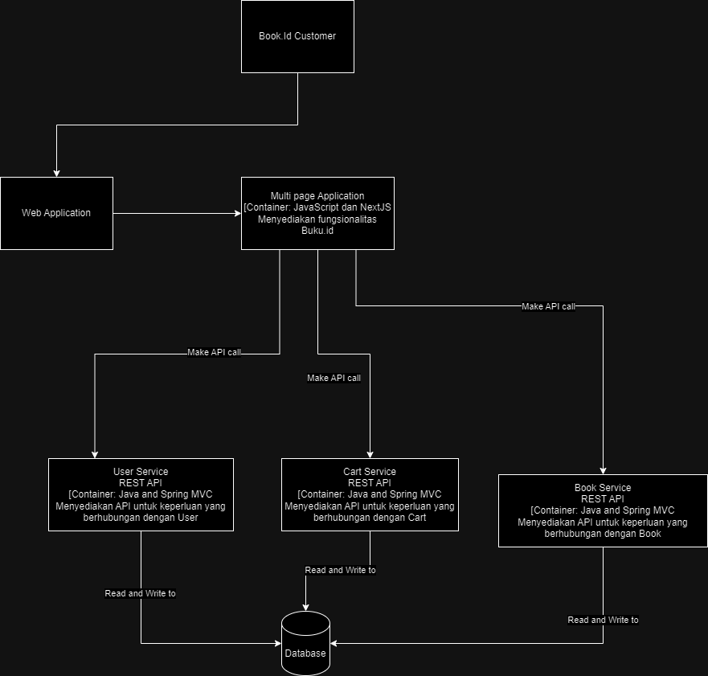
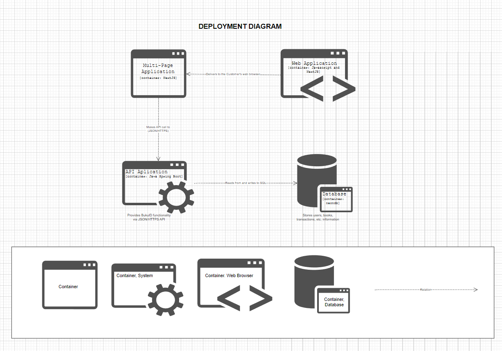
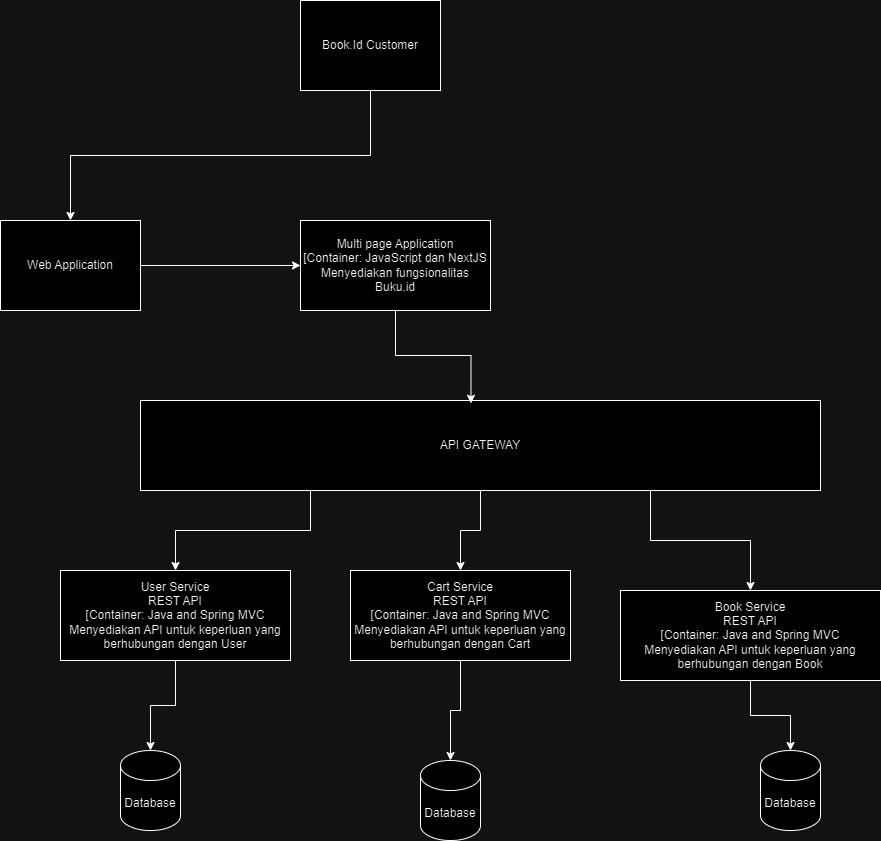

Container

Deploy

Future

API Gateway menyederhanakan dan mengabstraksi kompleksitas sistem dengan menyediakan satu titik akses tunggal untuk berbagai layanan mikro, sehingga klien tidak perlu mengetahui lokasi atau implementasi layanan tersebut. Fitur transformasi data memungkinkan API Gateway mengubah format permintaan dan respons sesuai kebutuhan, sementara caching membantu mengurangi latensi dan beban pada layanan mikro.
Memisahkan database di arsitektur mikroservis memberikan fleksibilitas, efisiensi, dan keamanan yang lebih besar, mendukung pengembangan dan operasional sistem yang lebih dinamis dan responsif terhadap perubahan kebutuhan bisnis.